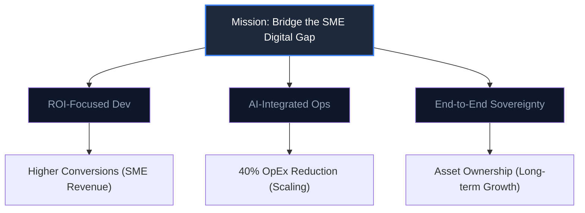

# Nexsol Corporate Mission & Vision

**Objective:** Aligning the entire agency under a unified purpose of engineering growth for Indian SMEs.

---

## 1. Our Mission
To bridge the digital gap for Indian SMEs by providing premium engineering, seamless AI automation, and ROI-driven solutions that transform "Marketplace Sellers" into "Global Brands."

## 2. Our Vision
To become India's leading "Growth Engineering" agency, setting the gold standard for how technology is used to scale small businesses into enterprise giants.

## 3. Core Values
- **Aesthetic Precision:** We don't just build code; we build art that works.
- **Technical Robustness:** Zero-downtime, sub-second speeds, and secure AI.
- **ROI Obsession:** If our work doesn't generate 2x-10x value for the client, we haven't finished.
- **Transparency:** No hidden costs, no generic templates, no technical jargon without business context.

## 4. Strategic Alignment Map

---

## 5. The Nexsol Edge
We combine the speed of a startup with the reliability of an enterprise, using an **AI-Native** approach to solve traditional business bottlenecks.
