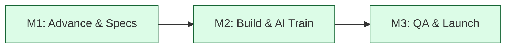

# SOW Master Template: Nexsol Enterprise Solutions

**This Statement of Work (SOW)** is governed by the Master Service Agreement (MSA) between **Nexsol Infotech** and **[Client Name]**.

## 1. Project Background
[Client Name] seeks to deploy a high-performance digital storefront integrated with AI automation and Direct-to-Consumer (D2C) capabilities.

## 2. Technical Scope of Deliverables
### Pillar 1: Digital Brand Storefront
- **Stack:** Next.js 15, React, Tailwind CSS.
- **Performance:** Sub-1s page load times.
- **Integration:** Omnichannel Marketplace sync.

### Pillar 2: Nexsol AI Layer
- **Lead Agent:** Custom qualifying chatbot.
- **Support Agent:** Business-specific FAQ RAG system.
- **Search Agent:** Intelligent product discovery.

## 3. Milestones & Timeline (The 21-Day Sprint)

| Milestone | Deliverable Description | Day Count | Payment |
| :--- | :--- | :--- | :--- |
| **M1: Kickoff** | Infrastructure, Tech Specs, Design Prototype. | Day 1-5 | 40% |
| **M2: Functional** | AI Integrations, Backend Sync, Checkout. | Day 6-15 | 40% |
| **M3: Release** | QA Sign-off, Domain Link, Final Training. | Day 16-21 | 20% |

## 4. Resource Allocation & Guarantee
Nexsol allocates a dedicated "Technical Authority" squad immediately.
- 1 x Senior Full-Stack Engineer.
- 1 x AI Orchestrator.
- 1 x Project Success Manager.

## 5. Acceptance Criteria
- 1st Paint < 0.8s.
- Zero inventory sync errors.
- Successful UAT sign-off.

---
**Agreed by [Client Name]:** ____________________
**Agreed by Nexsol Infotech:** ____________________
