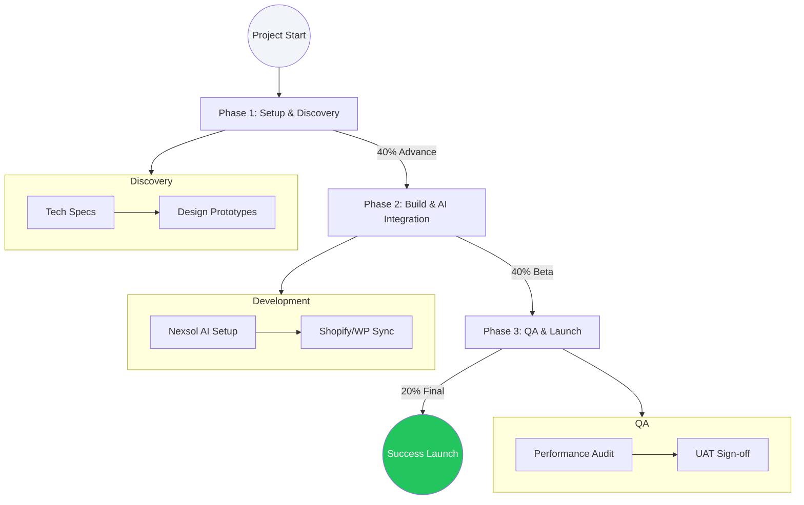

# Nexsol Operations: Lifecycle & Delivery (Internal Playbook)

**Target Audience:** Project Managers & Delivery Leads.
**Objective:** Predictable, high-quality deployment in 14-21 days.

---

## 1. The Delivery Lifecycle (Visualized)

---

## 2. SOP 01: The "Handoff" Drill
1. **Financial Clear:** Confirm 40% advance in account.
2. **Resource Lock:** Allocate 1 Dev + 1 QA to the project.
3. **Infrastructure:** Create Vercel project and GitHub repository using `Nexsol-Enterprise-Boilerplate`.

---

## 3. SOP 02: Client Communication Standards
- **Weekly Pulse:** One 15-min Loom video update sent every Friday.
- **Emergency Pivot:** If a client requests a major scope change, trigger the "SOW Amendment" process immediately.
- **Tone:** We are Consultants, not Order-Takers. Explain *why* we are making certain architectural choices.

---

## 4. SOP 03: The "Premium" QA Check
A Nexsol site must meet these criteria before the client sees it:
- [ ] **Lighthouse Score:** 90+ on Mobile Performance.
- [ ] **AI Latency:** < 1.5s response time for custom RAG agents.
- [ ] **ONDC Validity:** Zero errors in SKU sync with the seller dashboard.
- [ ] **Edge Compatibility:** Tested on weak 4G/5G connections (Simulated bandwidth throttling).

---

## 5. Final Handover & Support
1. **Invoice:** Issue the final 20% invoice *before* domain transfer.
2. **Training:** Recorded 30-min Zoom training session for the client team.
3. **The "Protect" Window:** Start the 30-day bug-free guarantee.

---

## 6. Internal Resource Protection
Rule: **No work begins on Phase 2 without Phase 1 sign-off.** This prevents resource waste and scope creep.
If the client is unresponsive for >72 hours, the project is put on "Pause Mode" and the timeline is shifted by 7 days.
