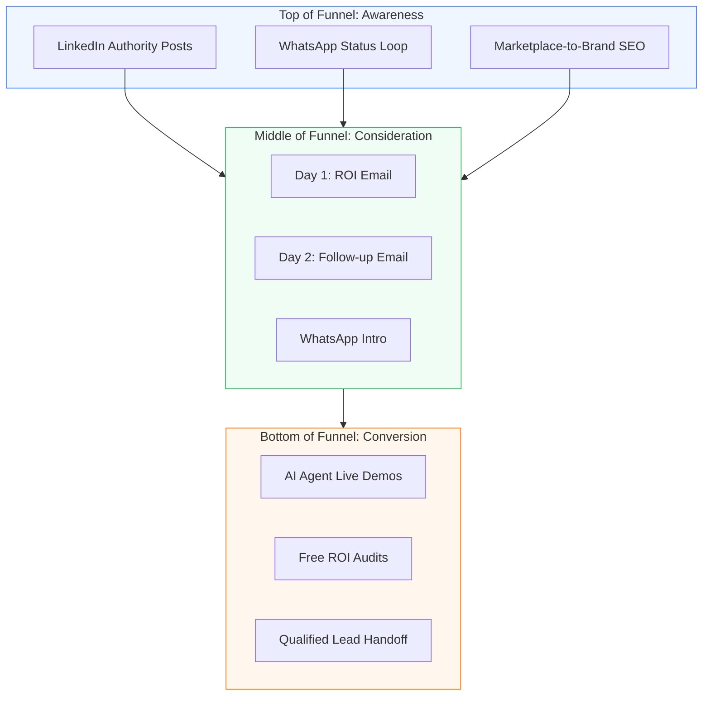

# Nexsol Marketing: Authority & Funnel (Internal Playbook)

**Target Audience:** Marketing Managers & Content Strategists.
**Objective:** Building a defensible brand through "Technical Authority."

---

## 1. The Marketing Visual Funnel

---

## 2. Content Pillars: Year-Round Strategy

### Pillar A: The "Marketplace Commission" War
**Messaging:** "You are building Amazon's brand, not yours."
**Action:** Share weekly charts comparing Marketplace margins vs. Brand Store margins.

### Pillar B: The "AI-Native" Advantage
**Messaging:** "Generic developers build pages; Nexsol builds agents."
**Action:** Screen-record our "Secret Sauce" in action (e.g., the AI SEO generator).

---

## 3. SEO Standard for Digital Brands
We prioritize "High-Intent Bottom-Funnel" keywords for Indian SMEs:
1. "Direct-to-Consumer Website Integration India"
2. "Custom Shopify Store for Electronics Pune"
3. "AI Chatbot for Grocery Delivery Business"
4. "Best Next.js Agency for E-commerce ROI"

---

## 4. The 6-Day ROI outreach Loop (Marketing)
Our most effective automated lead generation strategy.

#### Day 1: The "Commission Killer" Email
**Subject:** [Business Name] + Brand Ownership: Why you're losing 20% profit every day.
**Body:**
"Hi [Name], I noticed your products on [Flipkart/Amazon/External Marketplaces]. 
While marketplaces are great for volume, they own your customers and take a massive cut of your margin. 
At Nexsol, we help electronics/grocery sellers build your own 'Growth Engine' where they keep 100% of the profit. 
Would you be open to an ROI audit this week?"

#### Day 2-6: The Follow-up Sequence
1. **Day 2:** Email focusing on "Data Ownership."
2. **Day 3:** WhatsApp Intro with a video of an AI Agent.
3. **Day 5:** Urgency message regarding "Technical Authority" slots.
4. **Day 6:** Final takeaway / Bridge to Sales.

---

## 5. Marketing to Sales Handoff
Lleads are qualified by the Marketing Team based on:
- **Niche Alignment:** Electronics/Grocery/Logistics.
- **Channel Presence:** Are they already on Marketplaces/Amazon?
- **Engagement:** Have they interacted with our "ROI Audit" post?

---

## 6. Visual Brand Standards
- **Tone:** Professional, authoritative, transparent.
- **Imagery:** Dark aesthetics, neon accents (Blue/Green), high-tech high-relief mockups.
- **Logo:** Nexsol Infotech - Growth Engineers.
