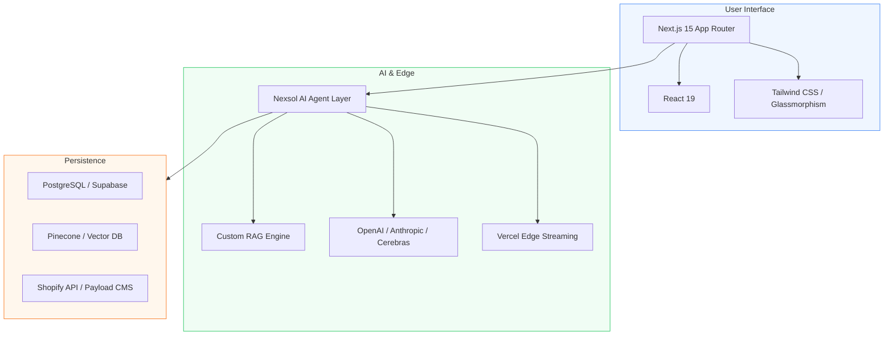

# Nexsol Engineering: AI-Native Tech Stack (Internal Playbook)

**Target Audience:** Senior Engineers & Full-Stack Developers.
**Objective:** Standardizing high-performance, AI-driven architectures.

---

## 1. The Core Stack (Nexsol Standard)

---

## 2. The AI-Native Philosophy
At Nexsol, AI isn't a feature; it's the core. 
- **RAG Architecture:** Every Enterprise site must use Retrieval-Augmented Generation for business-specific data.
- **Speed First:** Use Vercel Edge functions for AI streaming response to ensure zero perceived lag for the user.
- **Safety:** Implement strict guardrails to prevent AI "hallucinations" regarding product pricing or availability.

---

## 3. Coding Standards & Conventions
1. **Performance:** Prioritize Server Components over Client Components for faster First Contentful Paint.
2. **SEO:** Every page must have dynamic JSON-LD schema for Products, Reviews, and Local Business.
3. **Inventory Sync:** Use Webhooks for Marketplace and Shopify to ensure real-time inventory updates.

---

## 4. Nexsol AI Boilerplate Usage
- **Auth:** Clerk or NextAuth.
- **UI:** Custom-built components for premium feel (No generic MUI/Bootstrap).
- **Agents:** Use LangChain/LlamaIndex for orchestration.

---

## 5. Deployment Checklist
- [ ] Environmental Variables (API Keys, DB URLs) configured in Vercel.
- [ ] Edge Caching enabled for static product pages.
- [ ] AI Usage Monitoring (OpenPipe/Helicone) integrated.
- [ ] Final Build Optimization (Removing unused dependencies).

---

## 6. Technical Authority (Blogging SOP)
Engineers are required to document one "Technical Achievement" per sprint. 
*Example:* "How we reduced LLM latency by 40% for a Grocery client's FAQ bot."
This content is fed directly to the Marketing Team.
