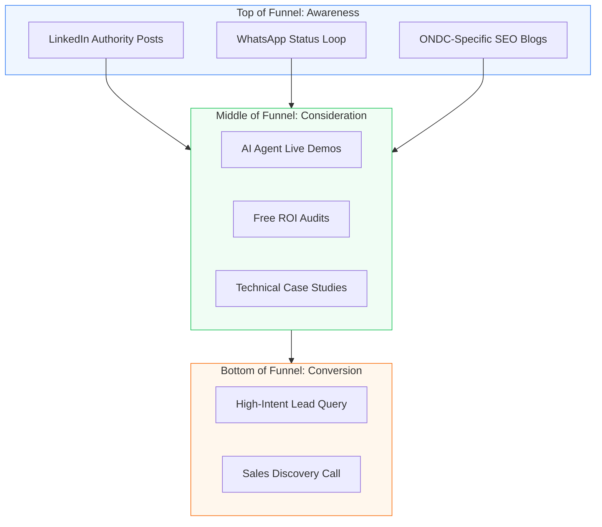

# Nexsol Marketing: Authority & Funnel (Internal Playbook)

**Target Audience:** Marketing Managers & Content Strategists.
**Objective:** Building a defensible brand through "Technical Authority."

---

## 1. The Marketing Visual Funnel

---

## 2. Content Pillars: Year-Round Strategy

### Pillar A: The "Marketplace Commission" War
**Messaging:** "You are building Amazon's brand, not yours."
**Action:** Share weekly charts comparing ONDC margins vs. Brand Store margins.

### Pillar B: The "AI-Native" Advantage
**Messaging:** "Generic developers build pages; Nexsol builds agents."
**Action:** Screen-record our "Secret Sauce" in action (e.g., the AI SEO generator).

---

## 3. SEO Standard for ONDC Sellers
We prioritize "High-Intent Bottom-Funnel" keywords for Indian SMEs:
1. "ONDC Seller Website Integration India"
2. "Custom Shopify Store for Electronics Pune"
3. "AI Chatbot for Grocery Delivery Business"
4. "Best Next.js Agency for E-commerce ROI"

---

## 4. The WhatsApp "status" Loop
Our most effective lead magnet for Indian sellers.
- **Monday:** Performance Win (Site loading speeds).
- **Wednesday:** AI Tip (How to automate FAQs).
- **Friday:** The "One Slot Left" Urgency.

---

## 5. Marketing to Sales Handoff
Lleads are qualified by the Marketing Team based on:
- **Niche Alignment:** Electronics/Grocery/Logistics.
- **Channel Presence:** Are they already on ONDC/Amazon?
- **Engagement:** Have they interacted with our "ROI Audit" post?

---

## 6. Visual Brand Standards
- **Tone:** Professional, authoritative, transparent.
- **Imagery:** Dark aesthetics, neon accents (Blue/Green), high-tech high-relief mockups.
- **Logo:** Nexsol Infotech - Growth Engineers.
