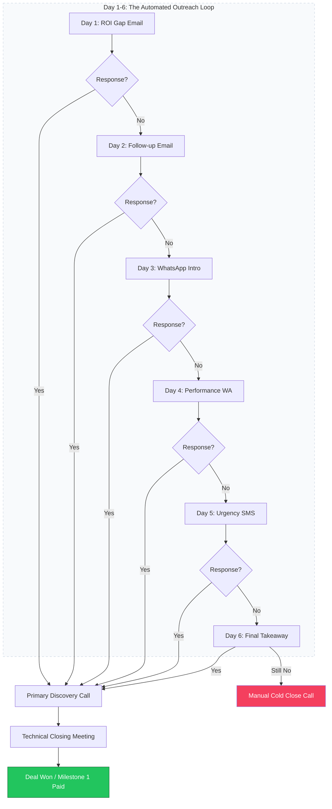

# Nexsol Sales: The Closing Engine (Internal Playbook)

> [!TIP]
> Never discuss pricing before establishing ROI. If the client asks about cost in the first 5 minutes, pivot back to the "Growth Gap."

**Target Audience:** Sales Consultants & Business Development Executives.
**Objective:** Mastering the art of high-ticket AI & Web Dev sales for Indian SMEs.

---

## 1. The Sales Philosophy: "Growth Engineers"
We do not sell websites. We sell **Business Freedom**.
- Generic agencies sell "features" (HTML, CSS, Pages).
- Nexsol sells "outcomes" (Automation, ROI, Brand Ownership).
*Rule:* If you talk about "coding," you are losing. If you talk about "commissions avoided," you are winning.

---

## 2. The 6-Day ROI Loop (Visualized)

### Detailed Outreach Templates
#### Day 1: The "Commission Killer" Email
**Subject:** [Business Name] + ONDC: Why you're losing 20% profit every day.
**Body:**
"Hi [Name], I noticed your products on [Flipkart/Amazon/ONDC]. 
While marketplaces are great for volume, they own your customers and take a massive cut of your margin. 
At Nexsol, we help electronics/grocery sellers build your own 'Growth Engine' where they keep 100% of the profit. 
Would you be open to an ROI audit this week?"

---

## 3. High-Impact Discovery (Primary Sales Call)
The goal is to determine if they are a ₹7k, ₹15k, or ₹Value prospect within 10 minutes.

### The "SME Pain" Framework:
1. **The Lead Extractor:** "How much are you spending on customer support calls every day?"
2. **The Budget Anchor:** "We specialize in scaling businesses from 100 orders to 1000 orders. What is your current infrastructure spend per month?"
3. **The Timeline Drill:** "If we launch your automated brand store in 23 days, how ready is your inventory team?"

---

## 4. Closing the Enterprise Deal (Value-Based)
When pitching custom AI agents:
- **Demonstrate, don't explain:** Show them a live demo of our technical authority blog generator.
- **The ROI Calculation:** "If this AI agent saves you 2 hours of manual lead qualification per day, it pays for itself in just 45 days."

---

## 5. Objection Handling Mastery
### Top 3 Killers:
1. **"Too Expensive":** Pivot to *cost of inaction*.
2. **"I use ONDC already":** Pivot to *brand ownership*.
3. **"No Time":** Pivot to *Nexsol's 3-week delivery SOP*.

---

## 6. Closing Strategy: The "Cold Close" Call
If the 6-day loop fails, use the direct phone approach:
"Hi [Name], I'm Tejas from Nexsol. I sent you a few messages but realized you're probably focused on today's orders. I'm calling because we're launching 3 stores in [Your Niche] this week and have one 'Technical Authority' slot left. Do you want your competitors to be the ones with AI automation, or do you want to lead the market?"

---

## 7. Handover Checklist (Sales to Ops)
- [ ] 40% Advance Invoice Paid.
- [ ] Client "Pain Point" documented in CRM.
- [ ] ONDC Seller Credentials collected.
- [ ] Kick-off call scheduled for Week 1.
