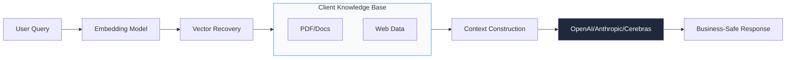

# Nexsol AI Automation: Enterprise AI SOPs (Internal Playbook)

**Target Audience:** AI Engineers & Automation Consultants.
**Objective:** Scaling business intelligence with custom LLM agents.

---

## 1. The AI Hierarchy
We categorize AI value into three tiers:
1. **Tier 1 (Support):** FAQ automation and customer interaction.
2. **Tier 2 (Ops):** Inventory forecasting and data sorting.
3. **Tier 3 (Sales):** Predictive lead scoring and personalized outreach.

---

## 2. RAG Implementation Standard

---

## 3. Automation "Secret Sauce" Templates
- **Sales qualifying loop:** Automated WhatsApp response to new marketplace leads.
- **SEO Agent:** Dynamic blog creation based on Google Search Console trends.
- **Support Agent:** 24/7 intelligent ticket resolution.

---

## 4. Security & Ethics
- Never store PII (Personally Identifiable Information) in LLM context windows.
- Regular bias audits for customer-facing agents.
- Monthly token-cost optimization for clients.

---

## 5. Deployment Roadmap
1. **Week 1:** Data Ingestion & Model Fine-tuning.
2. **Week 2:** Prompt Engineering & Testing.
3. **Week 3:** Integration with Web/App and Live Monitoring.
