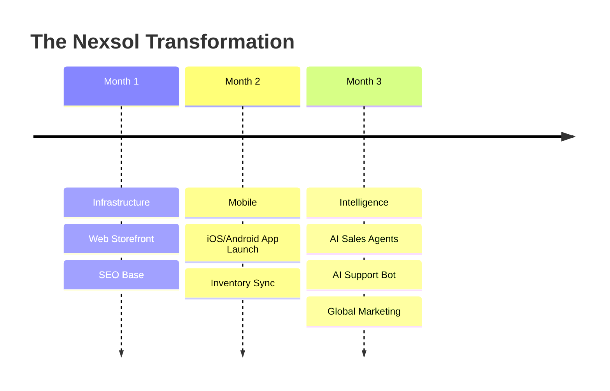

# Nexsol Transformation: End-to-End Digital Roadmaps

**Target Audience:** Strategic Consultants & Portfolio Managers.
**Objective:** Executing 3-6 month business transformations.

---

## 1. The Transformation Vision
We don't just sell one service; we take over a business's technical life. This involves a synced rollout of Web, App, and AI simultaneously.

---

## 2. The 90-Day Roadmap

---

## 3. High-Ticket Management SOP
1. **Weekly Steering Comittee:** 30-min call with the client CEO.
2. **Unified Dashboard:** One source of truth for all department progress.
3. **Risk Management:** Mid-project pivots handled within 48 hours.

---

## 4. Pricing & ROI
Transformation projects are exclusively **Value-Based**.
- **Investment:** Milestone-heavy (20/20/20/20/20).
- **ROI Goal:** 5x increase in brand value & 50% increase in operational profit.

---

## 5. Handover: The "New Normal"
Post-transformation, the client receives a 12-month growth plan and a dedicated project manager for continuous scaling.
