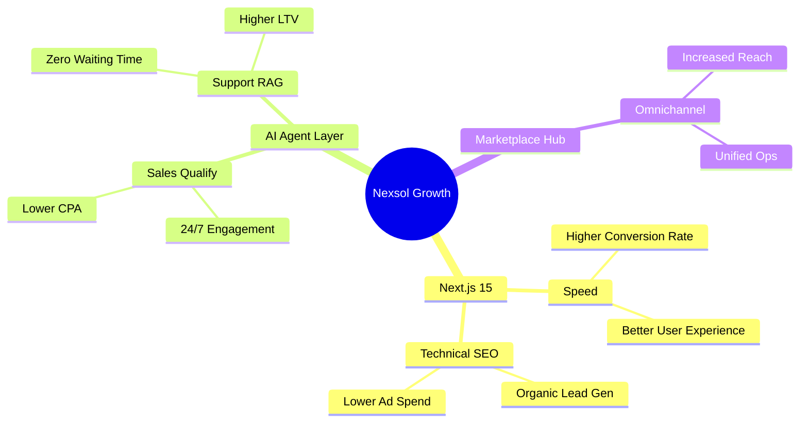
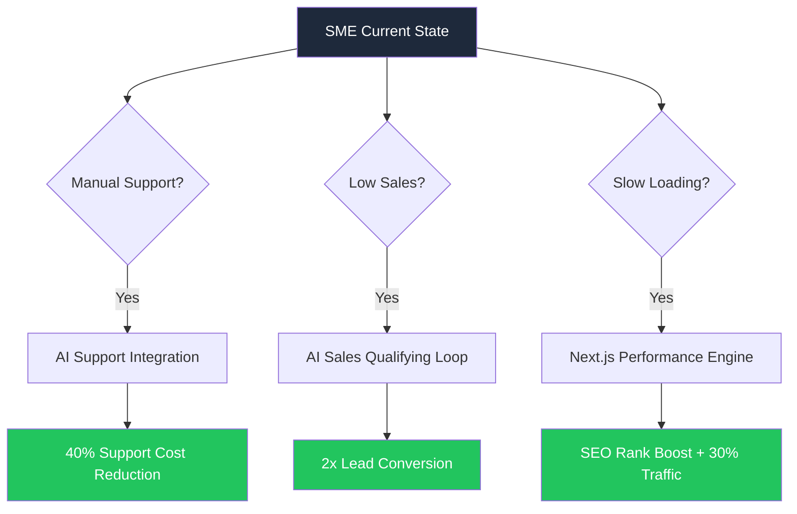

# Nexsol Feature-to-ROI Deep Dive

**Objective:** Total transparency on how engineering decisions impact your bottom line.

| Nexsol Feature | The "How" (Technical) | The "Why" (Business ROI) |
| :--- | :--- | :--- |
| **SSR & Edge Caching** | Pages render on the server, closest to the user. | **15% lift in mobile conversions** for semi-urban Indian users on slow nets. |
| **Custom AI RAG** | AI reads your specific PDF/Product data only. | **40% reduction in human support hours** spent on repetitive queries. |
| **Atomic Design System** | Reusable, lightweight UI components. | **60% faster turnaround time** for future site updates and features. |
| **Automated SEO Loop** | Engine generates technical authority content. | **Lower reliance on Paid Ads** as organic authority grows in 3-6 months. |

---

## 2. ROI Decision Tree (SME Perspective)

---
**Summary:** We don't build "websites." We build high-performance business machines designed to maximize your profit and minimize your manual work.
